# 星纵物联应用平台 文档中心

更加简单便捷的使用您的物联网设备。[立即登录](https://www.eztview.com/)

更新日期：2025-12-16

---

## 注册与登陆

网址：https://milesight.eztview.com

点击“立即登陆”，进入登陆页。

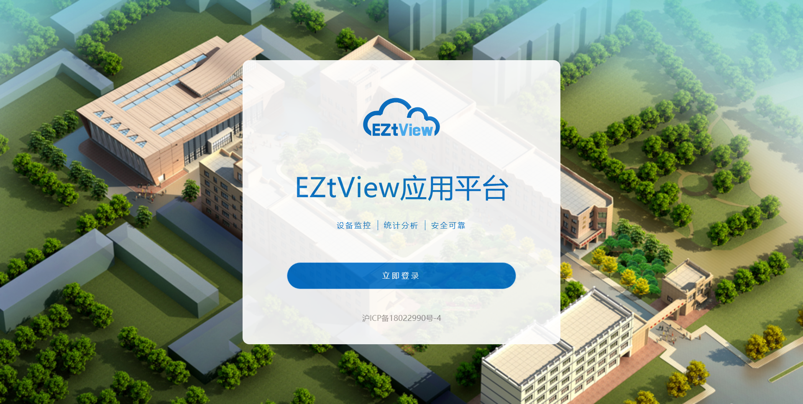

支持密码登陆、短信验证码登陆和微信扫码登陆。如果忘记密码，点击“忘记密码”重置，可以通过手机号码或电子邮箱重置密码。

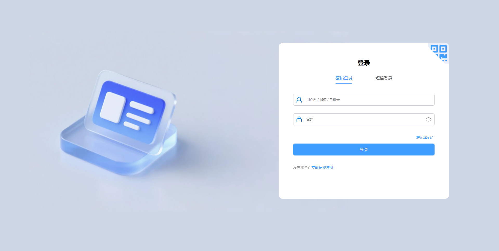

## 项目列表

成功登录后进入项目列表页，显示“我创建的项目”和“我加入的项目”，如果没有任何项目，可以点击“点击此处添加项目”创建空白项目或者让项目拥有者用户邀请您进入他的项目。

进入项目列表页有两种方式：**点击左上角LOGO处**和右上角**昵称--我的项目。**

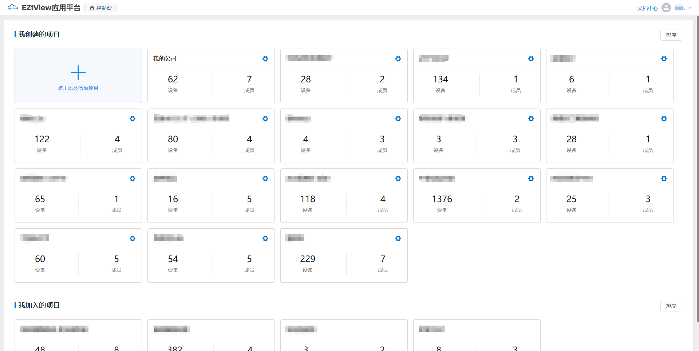

名词解释：

- **我创建的项目：**本账号自主创建的空白项目，需要给项目起个名字；
- **我加入的项目：**A账号创建的项目可以邀请B账号进入该项目，成功邀请后，B账号“我加入的项目”列表会出现该项目；
- **项目拥有者：**本账号自主创建的项目是该项目的拥有者，具有全部权限。

点击右上角昵称处，可以进入我的项目(项目列表页)、账号设置和退出登陆，其中账号设置页，可以修改用户名、修改昵称、绑定手机号码、绑定电子邮箱、绑定微信、修改密码登操作。

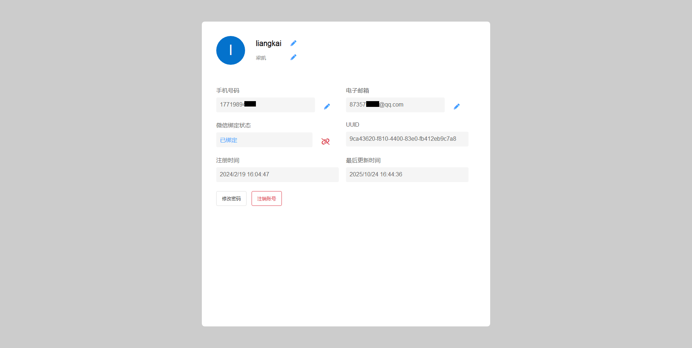

## **控制台**

在项目列表页，点击项目卡片任意处，进入项目控制台，项目控制台是该项目的管理中心，点击左上角**“切换”**按钮，可以切换其他项目。

### 操作指引

主要包括一下步骤：

1. 选择项目应用
2. 引入EZtCloud资源
3. 配置组织
4. 进入组织工作台

名词解释：

- 什么是EZtCloud？EZtCloud是物联网设备统一接入平台，星纵物联应用平台是基于EZtCloud提供的数据资源开发，所以星纵物联应用平台一个项目必定要绑定EZtCloud的一个项目，两个平台登录账号密码相同，EZtCloud平台网址：https://milesight.eztcloud.com

点击**“角色”、“组织”、“成员”**图标可以快速进入对应配置页面。

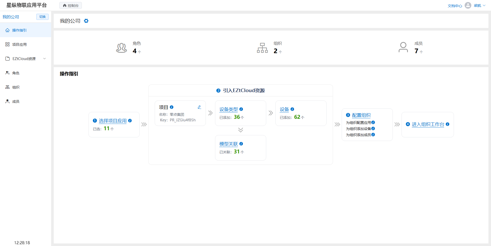

点击**设置**图标，可以查看和修改项目相关信息，包括修改项目名称、修改标题、移除项目等操作。

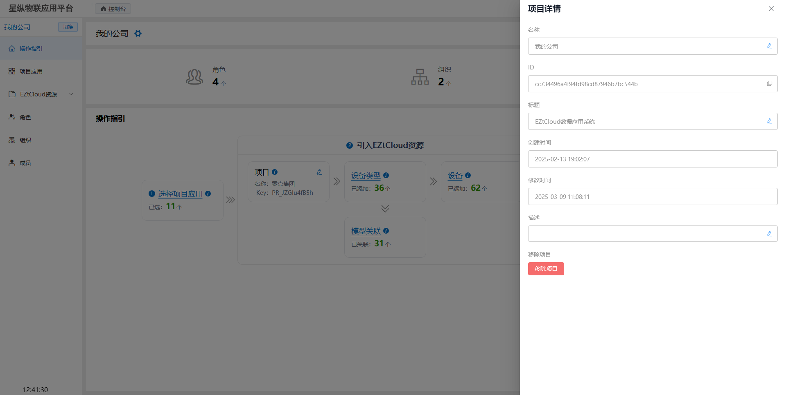

### 项目应用

包括“应用市场”和“我的应用”，一般一个项目有确定的需求，根据需求在应用市场找应用，然后点击**“添加”**，就将该应用添加到我的应用，我司会不断开发新的通用应用，以满足不同行业需求。

鼠标左键按住应用卡片左上角图标可以随意拖动排序。

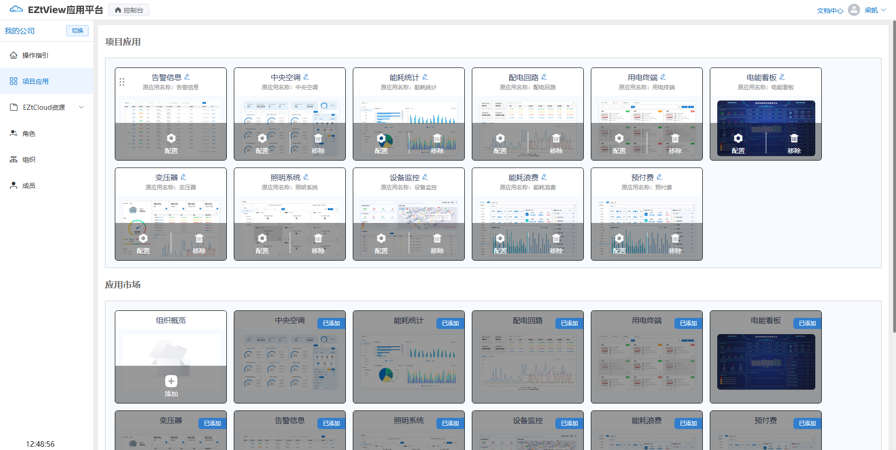

点击**“配置”**并选择组织，可以进入应用配置页。

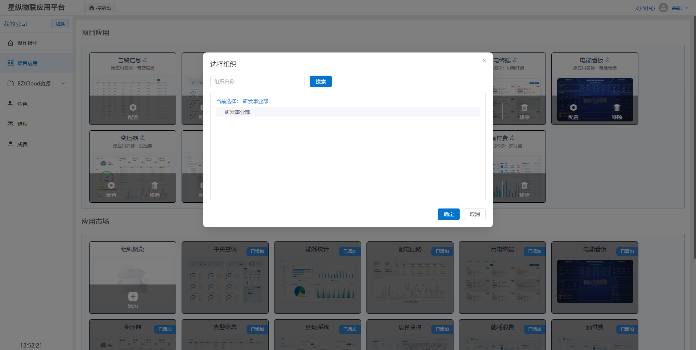

### EZtCloud资源

如前所述，星纵物联应用平台是基于EZtCloud提供的数据资源开发，所以需要将EZtCloud项目资源引入。

**注意：在操作指引中，将一个EZtCloud项目和一个星纵物联应用平台项目绑定是必要条件。**

#### 设备类型

点击**“添加”**按钮，选择左边栏设备类型名称，点击右箭头图标，就可以将该设备类型添加至星纵物联应用平台项目(以下统称：本系统)

当在EZtCloud中修改了设备类型相关信息，点击**“更新”**按钮。

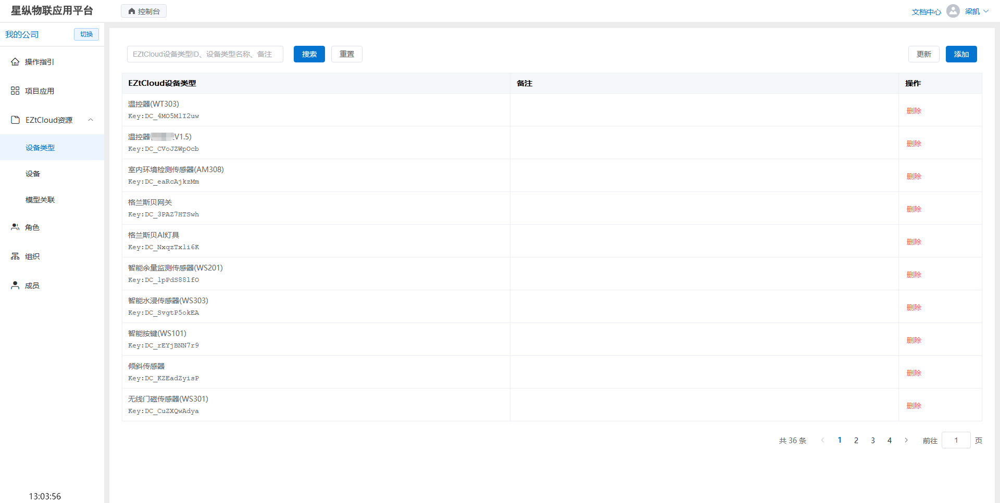

#### 设备

点击**“添加”**按钮，选择左边栏设备名称，点击右箭头图标，就可以将该设备添加至本系统

添加设备更快速的方式，点击**“同步”**按钮，就可以将设备同步至本系统

如果设备在EZtCloud已经删除，本系统设备也会失效，可以筛选已经失效的设备。

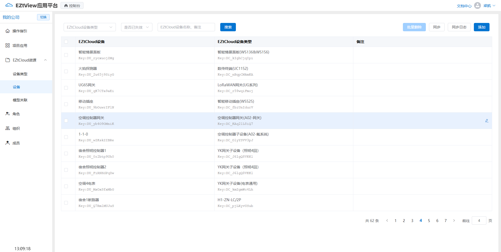

#### 模型关联

当一个应用开发完成，则该应用对应的设备模型是确定的，一个设备模型包含多个属性，每个属性表示该设备模型的一种功能，属性都有固定的标识符；一个设备模型可以对应多个EZtCloud设备类型，一个EZtCloud设备类型也可以对应多个设备模型。

点击**“添加”**按钮，进入关联页。在左边栏选中1个设备类型，在右边栏选中一个或多个设备模型，点击底部**“关联”**按钮。

**注意：正确关联非常关键，每个设备模型有相关联的应用。**

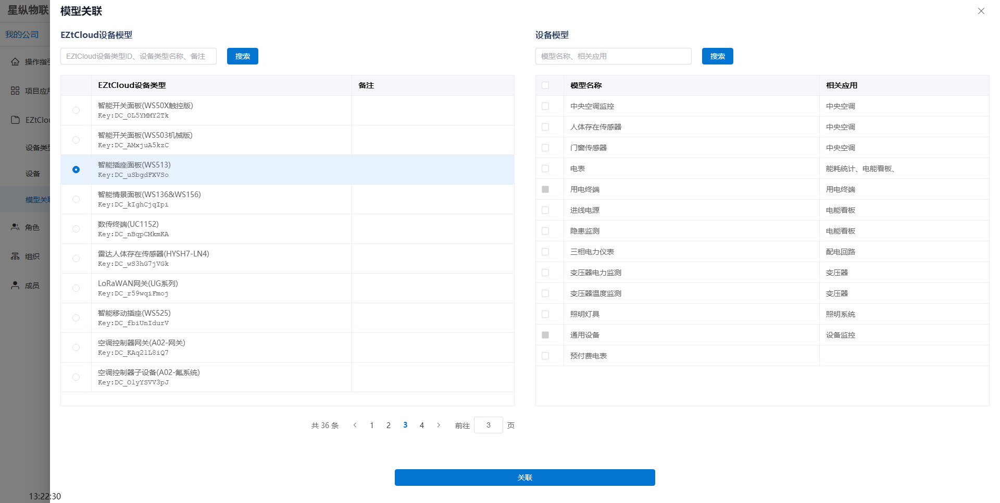

### 角色

角色用于一类用户需要相同的项目权限和应用权限，比如A和B用户具有相同的项目权限和应用权限。

点击**“添加角色”**进入新角色配置界面，给角色配置一个名称。

控制台权限，一般分为：查看、添加、配置、编辑、删除等。

工作台权限，目前只分为查看和操作，勾选**“操作”**，表示用户可以下发控制命令给设备。

注意：当不勾选**“查看”**，用户是看不到菜单页面的。

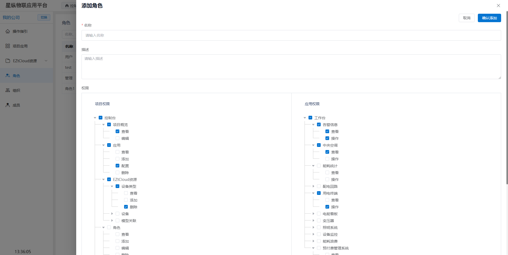

### 组织

一个项目会自动生成一个默认根组织(不能删除)，可以给每个组织添加成员，添加设备，配置应用。鼠标放在组织名称上，显示创建子组织，修改组织名称、删除组织和组织域名分享等图标。

- 组织排序：鼠标左键按住组织名称左侧图标，可以拖动组织排序。

- 修改组织名称：点击**“小铅笔”**图标，弹出组织名称修改窗。

- 添加子组织：点击“+”图标，弹出添加节点窗。

- 删除组织：点击**“删除”**图标，弹出是否确认删除窗。

- 工作台分享：点击**“分享”**图标，可以复制工作台URL，用户可以通过此URL快速登陆至组织工作台。

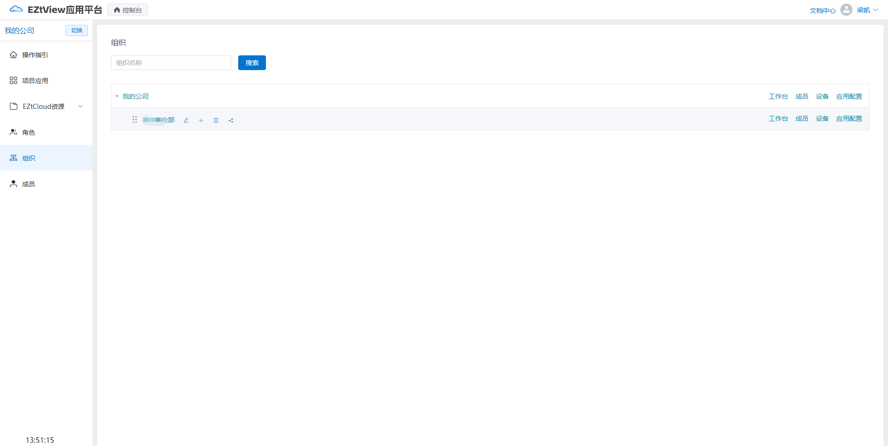

#### 为组织添加设备

在一个星纵物联应用平台项目中，可能有多个组织，不同组织需要关注的设备不同，所以需要将设备添加到组织里，一个设备只能属于一个组织，点击“设备”按钮进入组织设备添加页。

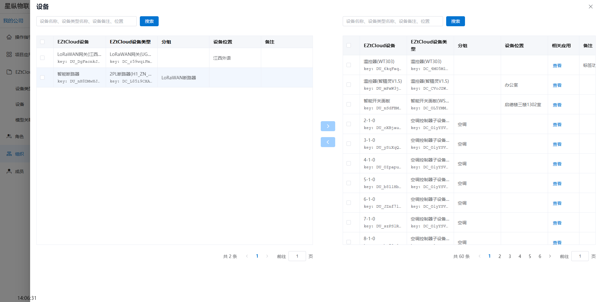

#### 为组织添加成员

点击**“成员”**跳转至控制台成员菜单页。

#### 进入组织“工作台”

点击**“工作台”**可以进入组织应用展示页面。

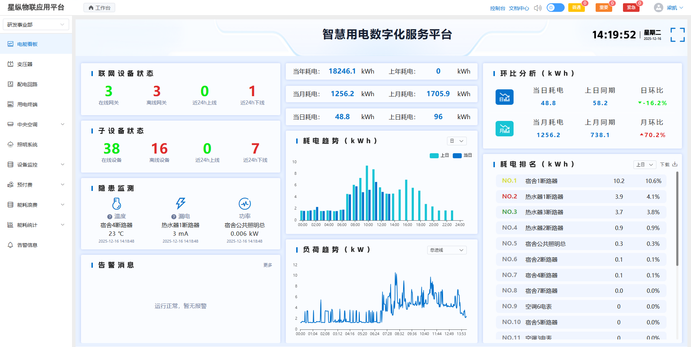

#### 组织应用配置

点击**“应用配置”**进入组织应用管理页，不同的组织可能有不同的应用需求，从项目应用添加应用至组织，点击应用卡片”配置“按钮进入应用配置页。

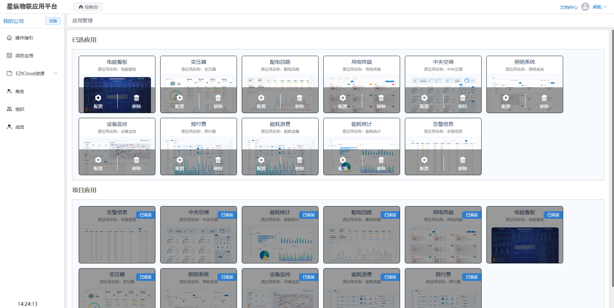

应用配置页：不同的应用，应用配置页有差异。

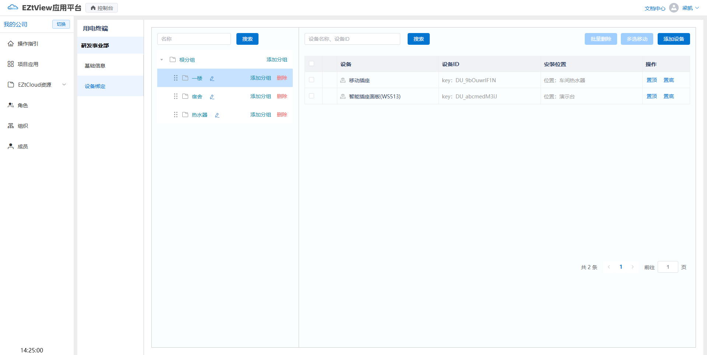

### 成员

点击**“邀请成员”**弹出邀请成员窗，只有项目拥有者才能邀请成员，邀请成员时要绑定组织、选择邀请方式和选择角色。

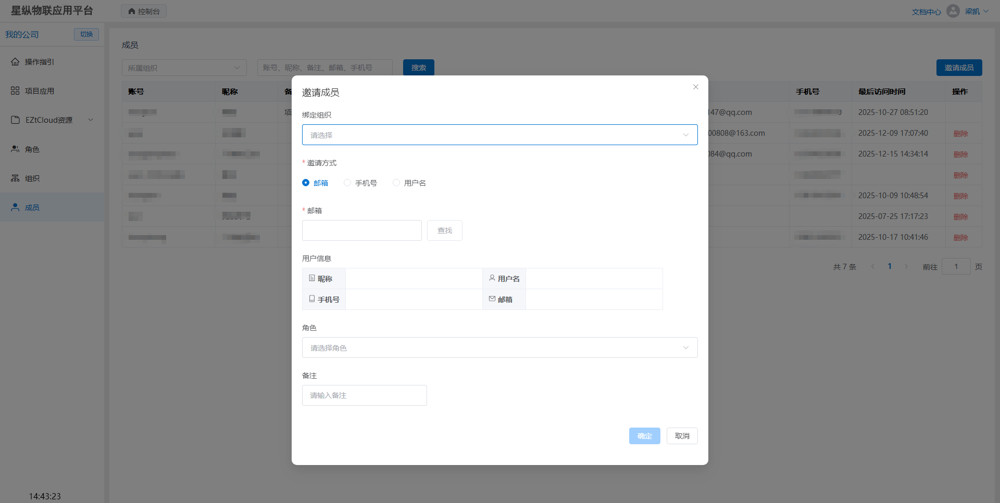

## 控制台高频问题

### 和设备添加相关的操作都有哪些？

1. 项目绑定
2. 设备类型添加和模型关联
3. 项目设备添加
4. 组织设备添加
5. 应用设备添加

### 一个成员工作台不显示已添加的应用什么原因？

检查该成员绑定角色的权限是否勾选。

操作路径：控制台--成员--查看角色；控制台--角色--编辑   

## 工作台

工作台主要用于展示组织应用，星纵物联应用平台平台有很多实用的应用，例如：

- 电能看板
- 配电回路监测
- 用电终端监测
- 中央空调系统
- 照明系统
- 通用设备监控
- 能耗统计(用能概况、用能统计、同比分析、环比分析、电能集抄、对比分析、能耗排名)
- 能耗浪费统计
- 告警信息

**我司根据市场反馈，会不断推出实用功能，如需定制应用，请联系销售人员**

### 照明系统

照明系统用于监控智能照明开关设备，如智能开关面板、智能照明模块、物联网灯具等。照明系统应用具备的功能如下：

- 分组筛选：默认隐藏，点击**“分组”**按钮，展示出分组列表，可快速筛选分组内设备
- 在线离线筛选
- 回路状态筛选：快速筛选全关和非全关设备
- 模糊搜索：按照设备名称、设备ID和设备位置搜索
- 视图转换：分为灯具视图和统计视图
- 刷新：照明应用非实时刷新，如有刷新需求，点击**“刷新”**按钮
- 全选操作：当前页面内所有照明开关设备**一键开灯**或**一键关灯**操作

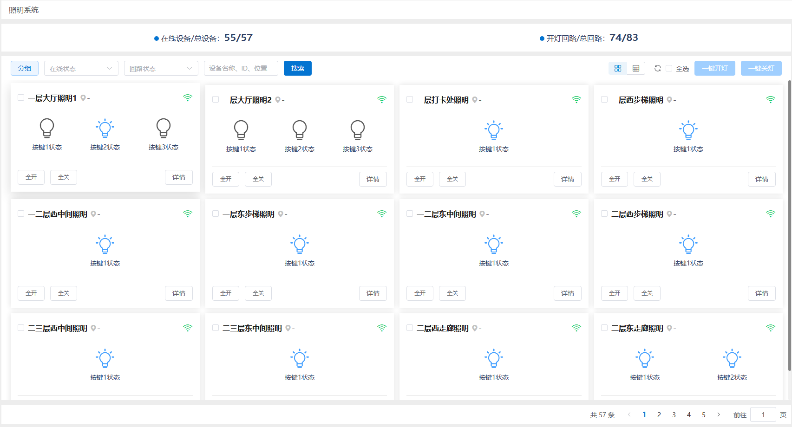

应用中，一个卡片对应一个照明开关设备，如一个智能开关面板。卡片内具有的操作如下：

- 照明开关单回路操作：在灯具视图下，直接点击“灯泡”图标进行开关灯操作
- 设备在线离线：卡片中"WiFi"图标绿色在线，灰色离线
- 单回路开关状态：“灯泡”蓝色表示灯泡亮，灰色表示灯泡灭

- 卡片选中：卡片左上角正方形图框，选中后，可以进行一键操作
- 设备名称：在EZtCloud中可修改
- 设备安装位置：在EZtCloud中可修改，没配置则不显示
- 设备回路名称：在EZtCloud中可修改
- 全开和全关操作：打开和关闭该照明开关设备所有回路
- 详情：灯具视图最多展示3个灯具，多于3个在详情内查看和控制

- 设备状态：点击“WiFi”图标弹窗展示设备信息，包括设备名称、设备Key、设备类型名称、设备类型Key、设备在线状态

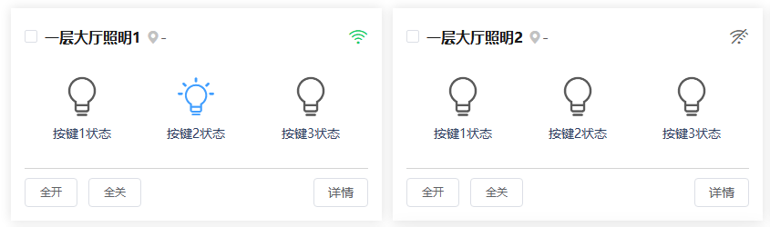

### 中央空调

中央空调应用用于监控智能空调控制设备，如智能温控器、空调网关等。中央空调应用具备的功能如下：

- 数量统计：开机数量、离线数量、故障数量等

- 分组筛选：默认隐藏，点击**“分组”**按钮，展示出分组列表，可快速筛选分组内设备
- 在线离线筛选
- 开关状态筛选：快速筛选开机和关机设备
- 模糊搜索：按照设备名称、设备ID和设备位置搜索
- 刷新：空调应用非实时刷新，如有刷新需求，点击**“刷新”**按钮
- 扩展功能：无人自动关闭空调功能和门窗打开提醒功能，此两项功能需要另外安装相关传感器硬件，如项目中未安装，则不具备该功能

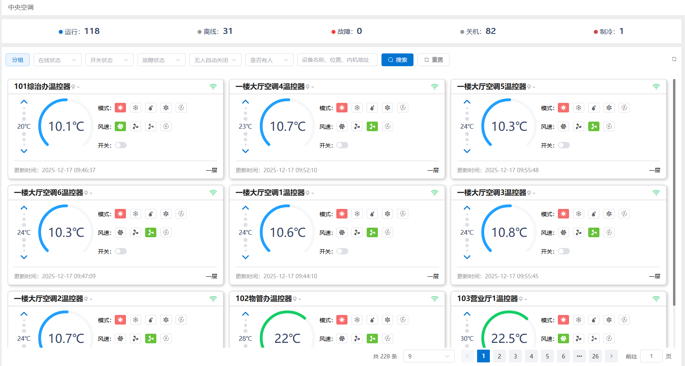

应用中，一个卡片对应一个空调控制设备，如一个智能温控器。卡片内具有的操作如下：

- 设备在线离线：卡片中"WiFi"图标绿色在线，灰色离线

- 设备名称：在EZtCloud中可修改
- 设备安装位置：在EZtCloud中可修改，没配置则不显示

- 设备状态：点击“WiFi”图标弹窗展示设备信息，包括设备名称、设备Key、设备类型名称、设备类型Key、设备在线状态
- 设备所在分组：卡片右下角显示
- 设备监控：包括调节温度、切换模式、切换风速、设备开关
- 调节温度：点击上下箭头
- 切换模式：点击模式图标，包括制热、制冷、除湿、通风、自动
- 切换风速：点击风速图标，包括高风、中风、低风、自动
- 设备开关：点击开关图标
- 体感状态：显示室内温度，根据室温温度评估体感状态，蓝色表示较冷、绿色表示舒适、红色表示较热

**注意：切换模式中，有些设备不支持除湿和自动；切换风速中，有些设备不支持自动**

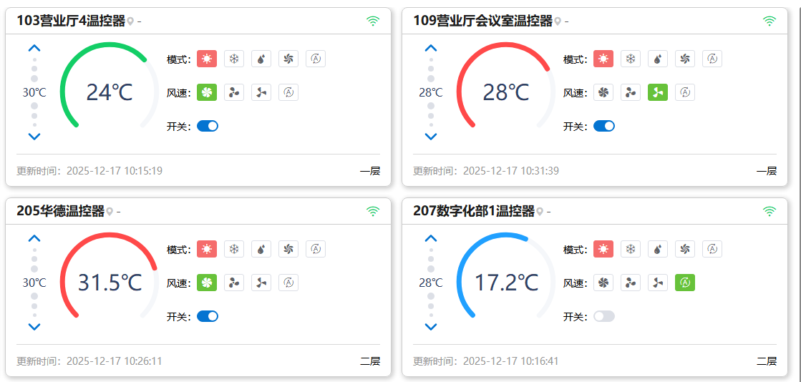

中央空调应用具备批量控制功能，进入“批量控制”菜单，先选中列表中的设备，再预置设备状态，最后点击**"生效"**按钮

在应用配置中，当空调设备绑定了人体传感器，空调设备就可以和人体传感器联动，实现无人延时自动关闭空调，设置好是否开启和延时时间，点击**“生效”**按钮

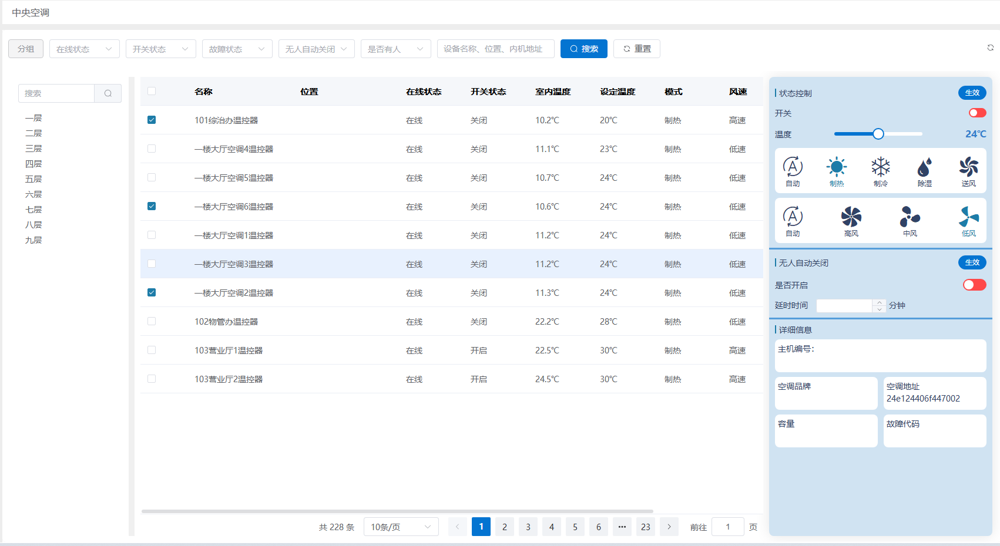

### 通用设备监控

该应用的通用性在于，所有的EZtCloud设备均可以在该应用中进行查看数据和远程控制，并且可以将设备、设备属性、设备集合放在设备分布图中进行直观展示。

#### 概览页

- 概览页数据是自动刷新的
- 点击右上角正方形图标，可以全屏显示
- 联网设备状态：直连设备在线状态，如网关
- 子设备状态：非直连设备在线状态，如需要通过网关上报数据的温湿度传感器
- 告警消息：有告警产生时，实时显示，点击**更多**，跳转至**“告警信息”**应用
- 设备分布图：在应用配置中添加，点击**“水滴”**图标，弹出设备详情页，可以查看设备实时和历史数据，也可以下发控制，水滴标绿色表示设备正常、灰色表示设备离线、红色表示设备告警；点击**“设备集合”**图标，跳转至**设备管理**页面对应的分组。如有多张设备分布图，可以切换。
- 设备列表：按照设备名称、设备位置、设备Key模糊搜索；按照在线状态搜索；按照告警状态搜索；点击列表内详情，弹出设备详情页；点击“WiFi”图标弹窗展示设备信息，包括设备名称、设备Key、设备类型名称、设备类型Key、设备在线状态

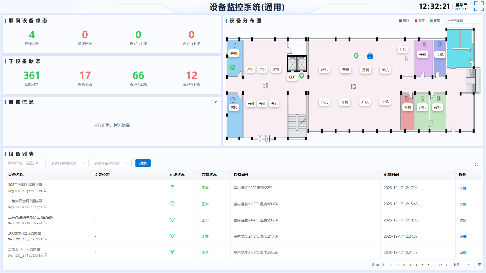

设备详情页

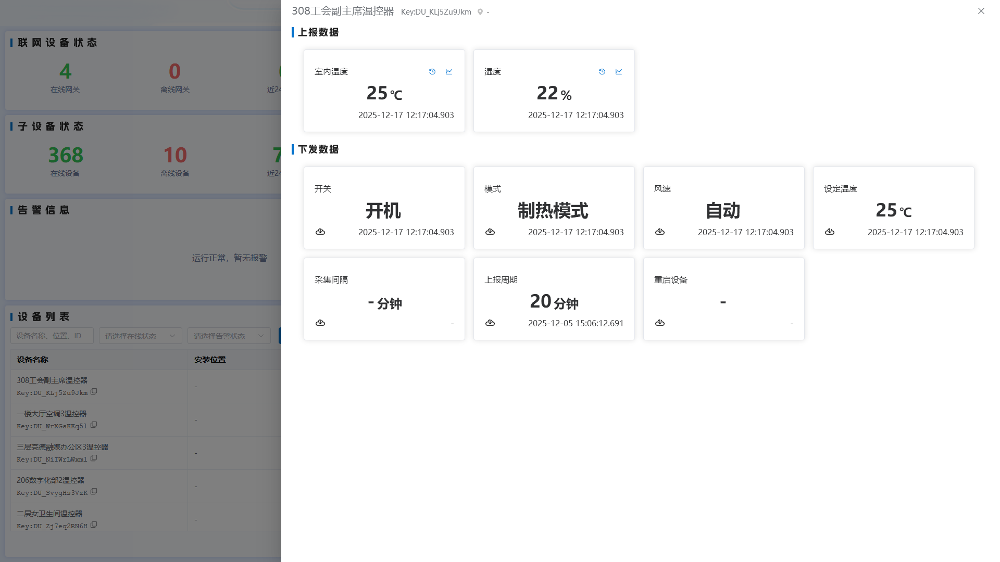

设备历史数据

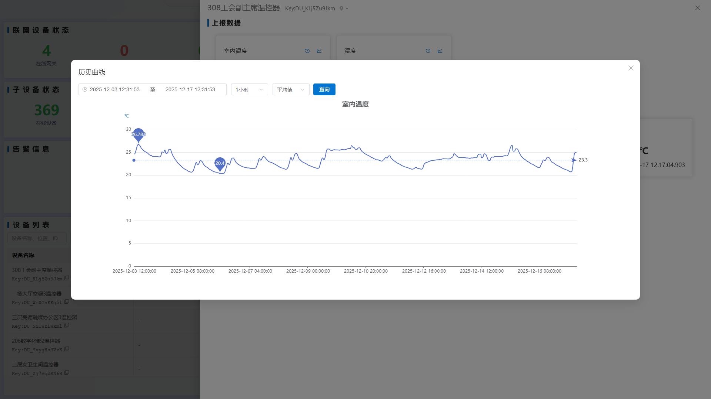

#### 设备管理页

- 统计设备数量：设备总数、正常设备数量、告警设备数量、离线设备数量

- 分组筛选：默认隐藏，点击**“分组”**按钮，展示出分组列表，可快速筛选分组内设备
- 在线离线筛选
- 告警状态筛选：快速筛选告警设备
- 模糊搜索：按照设备名称、设备ID和设备位置搜索
- 刷新：页面非实时刷新，如有刷新需求，点击**“刷新”**按钮

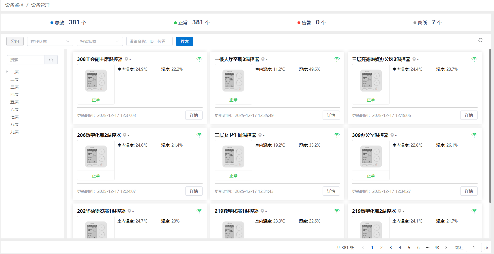

应用中，一个卡片对应一个设备，卡片内具有的操作如下：

- 设备在线离线：卡片中"WiFi"图标绿色在线，灰色离线

- 设备名称：在EZtCloud中可修改
- 设备安装位置：在EZtCloud中可修改，没配置则不显示
- 详情：弹出设备详情页，可以查看设备实时和历史数据，也可以下发控制

- 设备状态：点击“WiFi”图标弹窗展示设备信息，包括设备名称、设备Key、设备类型名称、设备类型Key、设备在线状态
- 数据展示：卡片内只展示设备上报的数据，如需控制，点击**"详情"**按钮

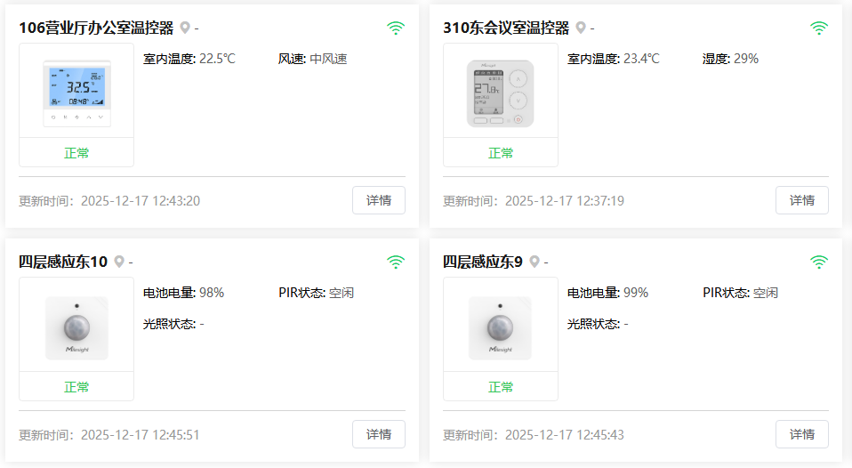

### 电能看板

在应用配置中，添加哪些是电源设备、哪些是负载设备、哪些是隐患监测设备，让用户快速了解整体用电情况和设备状态

- 页面自动刷新
- 点击右上角正方形图标，可以全屏显示
- 设备状态：联网设备在线状态，一般是直接联网设备，如网关；子设备在线设备一般是非直接联网设备

- 隐患监测：当前设备温度最大值；当前设备漏电最大值；当前设备功率最大值
- 电源设备耗电：包括当日、当月、当年、上日、上月、上年
- 电源设备环比分析：当日当月与上日上月同期耗电对比
- 负载设备耗电排名：上日上月耗电排名和占比，如负载设备较多，鼠标放至该区域，可滚动查看
- 告警消息：有告警产生时，实时显示，点击**更多**，跳转至**“告警信息”**应用
- 负荷趋势：显示某一个电源设备当日功率曲线，如有多个电源设备，点击**“箭头”**可切换

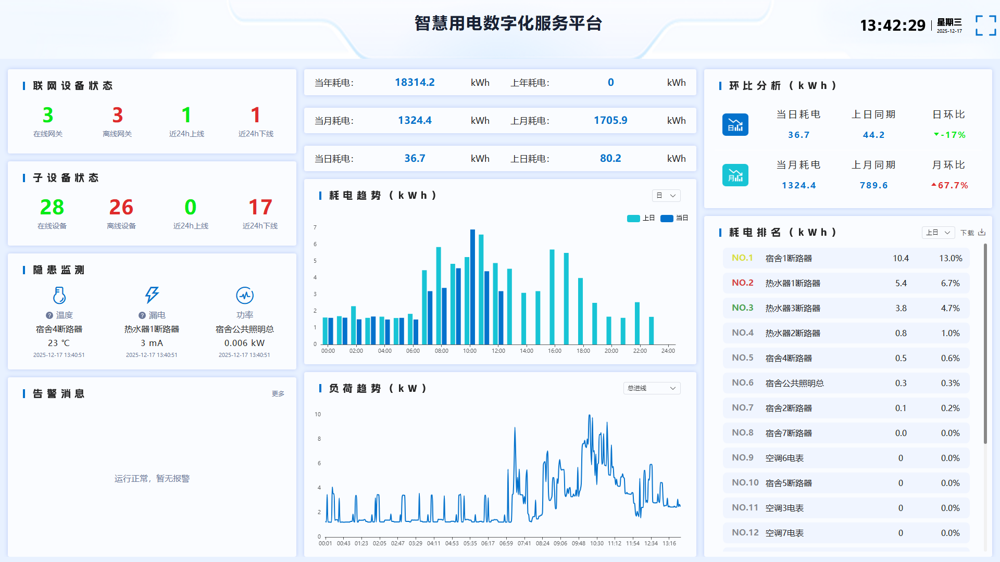

### 配电回路

主要用于监测配电柜塑壳断路器回路，查看极值数据、实时数据、能耗、历史数据曲线等

- 在左侧树结构中，可模糊搜索，快速查找设备
- 设备信息：显示设备名称和安装位置，点击“WiFi”图标弹窗展示设备信息，包括设备名称、设备Key、设备类型名称、设备类型Key、设备在线状态
- 极值数据：日月电流极大值，日月功率极大值
- 实时数据：当页显示电流、电压、功率、功率因数、电能，点击**“更多”**显示全部实时数据
- 历史曲线：日原始曲线和极值曲线，默认显示电流，如需查看其他参量，点击下箭头切换
- 能耗：日月年耗电量统计

### 用电终端

主要用于监测智能空开、智能插座等设备，实现状态监测、批量控制、功率限制、实时和历史数据查看、告警信息查看、能耗排名等

- 设备统计：设备总数、正常设备数量、告警设备数量、离线设备数量和超功率设备数量
- 设备排名：默认不展示，点击**“展开”**，显示当前功率最大设备、上日前五能耗设备、上月前五能耗设备
- 设备筛选：按照分组筛选、在线状态筛选、报警状态筛选、开合状态筛选、模糊筛选
- 刷新：页面非实时刷新，如有刷新需求，点击**“刷新”**按钮
- 全选操作：当前页面内所有设备**批量闭合**或**批量断开**操作
- 视图切换：设备卡片视图和列表视图，在列表视图可以配置限额功率

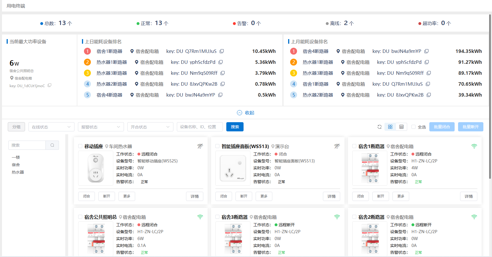

列表视图和限额功率页

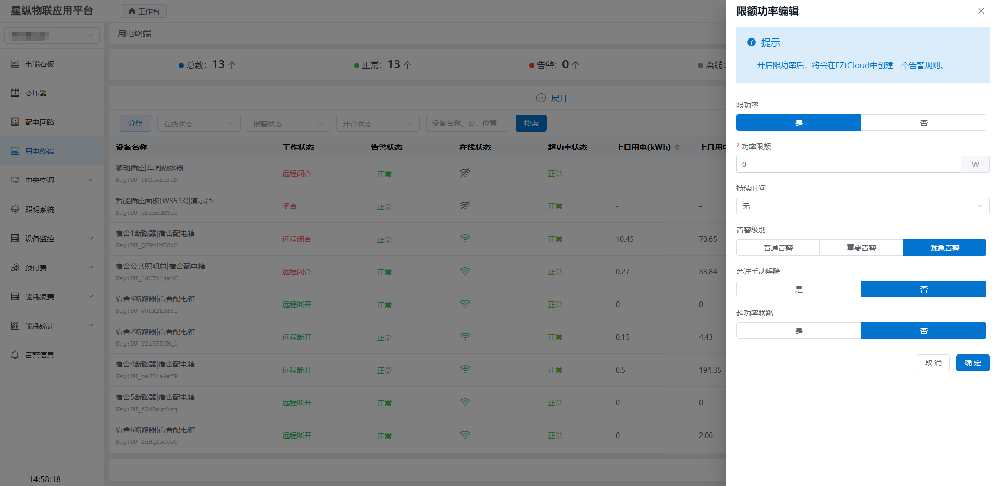

应用中，一个卡片对应一个设备，如一个智能空开或智能插座。卡片内具有的操作如下：

- 设备在线离线：卡片中"WiFi"图标绿色在线，灰色离线
- 卡片选中：卡片左上角正方形图框，选中后，可以进行批量操作
- 设备名称：在EZtCloud中可修改
- 设备安装位置：在EZtCloud中可修改，没配置则不显示
- 详情：在此页面可以查看所有设备状态、实时数据、历史数据、控制日志、控制设备等
- 设备状态：点击“WiFi”图标弹窗展示设备信息，包括设备名称、设备Key、设备类型名称、设备类型Key、设备在线状态
- 设备操作：闭合是通电、断开是断电，如果设备支持更多操作，点击**“更多”**按钮

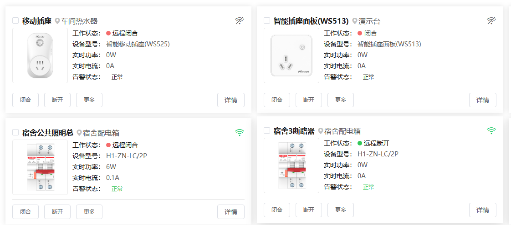

设备详情页

### 告警信息

告警信息是必选应用，展示所有设备的告警状态变化记录。告警状态有告警、告警待定、正常。如果一条告警由告警态恢复为正常态，会产生一条正常记录，同时告警记录会显示**“已恢复”**标签

告警恢复正常的两种途径：

- 设备真实恢复了正常，并且上报了正常数据；如设定温度告警阈值为45℃，上报了一条温度为50℃数据，触发高温告警，待上报一条温度为40℃的数据
- 平台解除了告警状态，但设备是否告警状态真实恢复，平台不可知，如果设备还处于告警状态，并且又上报了数据，平台会再次触发告警

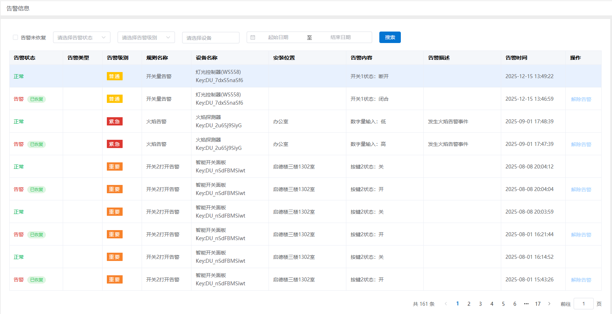

